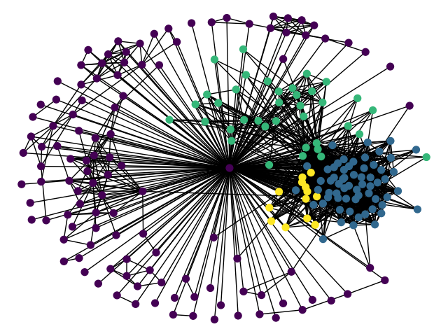
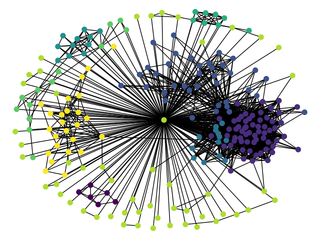

# Local graph community detection
---

# Introduction
---
## Local graph
Local graph is a graph with: 
- The set of vertices consists of a central node and its neighboring vertices.
- The set of edges that connect between vertices.
In social network analysis, local graph are often used to analyze structure of a user's communities.

## Louvain method - community detection
Louvain is a community detection method based on the optimization of [Modularity](https://en.wikipedia.org/wiki/Modularity_%28networks%29). The method is a greedy optimization method.
The algorithm of Louvain method is described in _Fast unfolding of communities in large networks, Vincent D Blondel, Jean-Loup Guillaume, Renaud Lambiotte, Renaud Lefebvre, Journal of Statistical Mechanics: Theory and Experiment 2008(10), P10008 (12pp)_.

## Louvain_local method
Louvain_local is an improved community detection method from Louvain to work better on local graphs.

Problems: When we apply Louvain on local grpah, the small size communities are joined together with 1 degree vertices and forming a big community.

Idea: The idea of this method is re-scan again into this big community to detect small size comminties.

Source code is cloned from [python-louvain](https://github.com/taynaud/python-louvain) and modified.

The difference between community detection results when using Louvain and Louvain_local is shown as below. Vertices in same community are same color.

Community detection results when using [python-louvain](https://github.com/taynaud/python-louvain). The small size communities are joined together with 1 degree vertices and forming a big community.



Community detection results when using [Louvain_local](https://github.com/dukn/louvain_local). Small size comminties are detected.


# Build and Install
---
Build and install from source:
```
$ git clone https://github.com/dukn/louvain_local.git
$ cd louvain_local
$ pip install .
```

# Using
---
Detect community with function `get_clusters`. To call, we import *louvain_local* from python.
```
import louvain_local
```
# Tests
---
Detect community:
```
import louvain_local
import networkx as nx
G = nx.Graph()
# ... load graph
clusters = louvain_local.get_clusters(G)
print (cluster)
```
# Author
---
Project was built by **Duy Nguyen** (s8hhnguy@stud.uni-saarland.de) in the first version and **Duc Nguyen** (nguyentanduc96@gmail.com) continued to develop the following versions.

# Refs
---
[python-louvain](https://github.com/taynaud/python-louvain)
