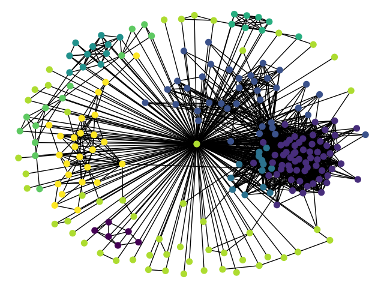

# Phát hiện cộng đồng trên đồ thị cục bộ (Local graph community detection)
---

# Giới thiệu
---
## Đồ thị cục bộ
Đồ thị cục bộ (local graph) là  đồ thị có:
- Tập đỉnh gồm một đỉnh trung tâm (central node) và các đỉnh kề của nó.
- Tập cạnh là các cạnh giữa các đỉnh trong tập đỉnh.
Trong phân tích mạng xã hội, đồ thị cục bộ thường dùng để phân tích cấu trúc cộng xung quanh của một người dùng.

## Phương phá phát hiện cộng đồng Louvain
Louvain là phương pháp phát hiện cộng đồng dựa trên cơ sở tối ưu hóa [Modularity](https://en.wikipedia.org/wiki/Modularity_%28networks%29) bằng giải thuật tham lam.
Giải thuật của phương pháp Louvain được mô tả trong _Fast unfolding of communities in large networks, Vincent D Blondel, Jean-Loup Guillaume, Renaud Lambiotte, Renaud Lefebvre, Journal of Statistical Mechanics: Theory and Experiment 2008(10), P10008 (12pp)_.

## Phương pháp louvain_local
Louvain_local là phương pháp phát hiện cộng đồng được được nâng cấp từ phương pháp Louvain để phù hợp với đồ thị cục bộ.

Vấn đề khi áp dụng louvain cho đồ thị cục bộ là các cộng đồng có kích thước nhỏ bị dồn lại vào cùng với các đỉnh bậc 1.

Ý tưởng của phương pháp là quét lại 1 lần nữa vào cộng đồng có các đỉnh bậc 1 này để phát hiện ra các cộng đồng có kích thước nhỏ.

Source code được clone từ [python-louvain](https://github.com/taynaud/python-louvain) và modify lại.

Khác nhau giữa kết quả phát hiện cộng đồng khi sử dụng Louvain thông thường và Louvain_local như hình dưới. Các đỉnh cùng cộng đồng sẽ có cùng màu.

Kết quả phát hiện cộng đồng khi sử dụng [python-louvain](https://github.com/taynaud/python-louvain). Các cộng đồng nhỏ bị gọp chung với các đỉnh bậc một tạo thành 1 cộng đồng lớn.


Kết quả phát hiện cộng đồng khi sử dụng [Louvain_local](https://github.com/dukn/louvain_local). Các cộng đồng nhỏ được tách ra khỏi cộng đồng chứa các đỉnh bậc 1.


# Cài đặt
---
Build và install từ source:
```
$ git clone https://github.com/dukn/louvain_local.git
$ cd louvain_local
$ pip install .
```

# Sử dụng
---
Phát hiện cộng đồng bằng hàm `get_clusters`. Để sử dụng, ta gọi thư viện *louvain_local* từ python.
```
import louvain_local
```
# Tests
---
Phát hiện cộng đồng bằng cách:
```
import louvain_local
import networkx as nx
G = nx.Graph()
# ... load graph
clusters = louvain_local.get_clusters(G)
print (cluster)
```

# Tham Khảo
---
[python-louvain](https://github.com/taynaud/python-louvain)
